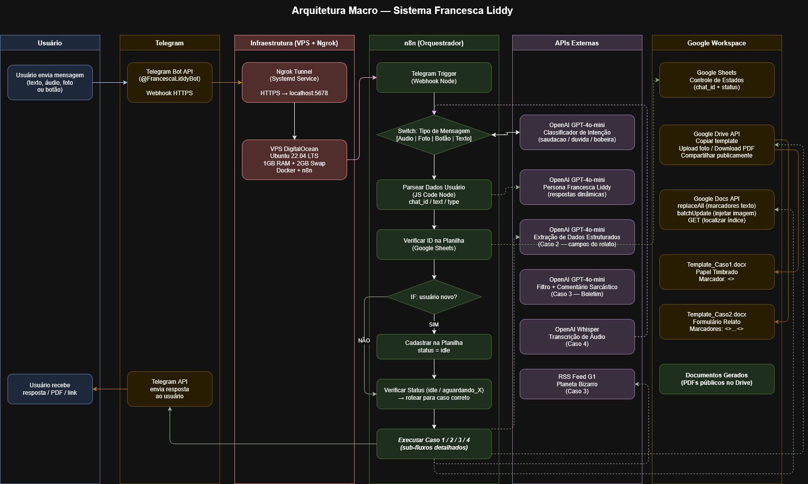
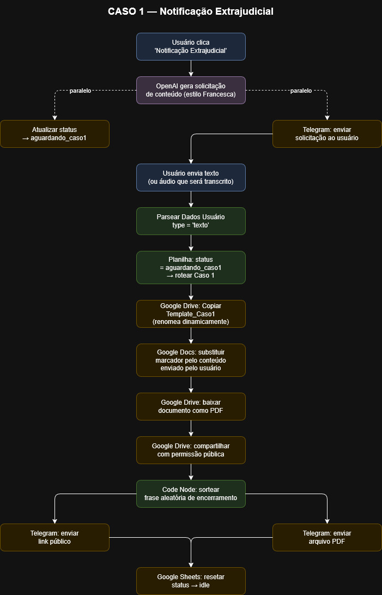
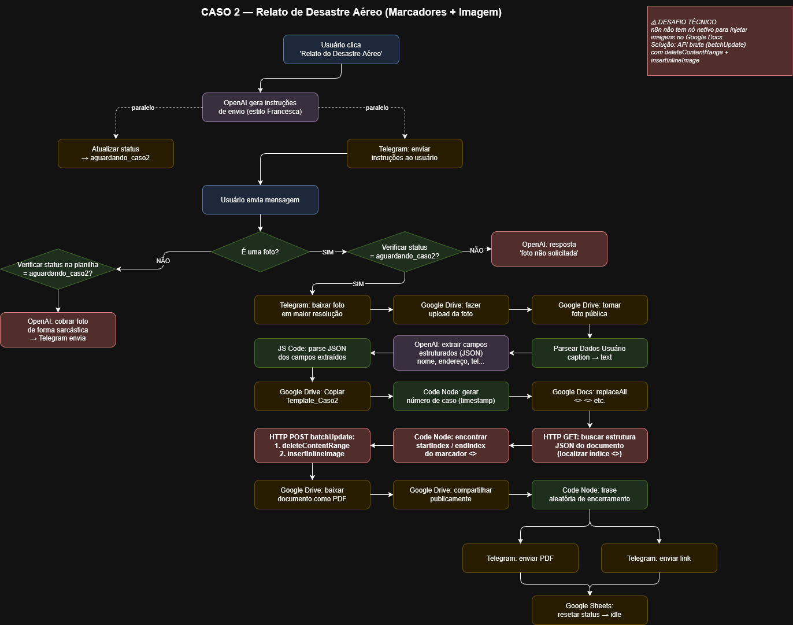
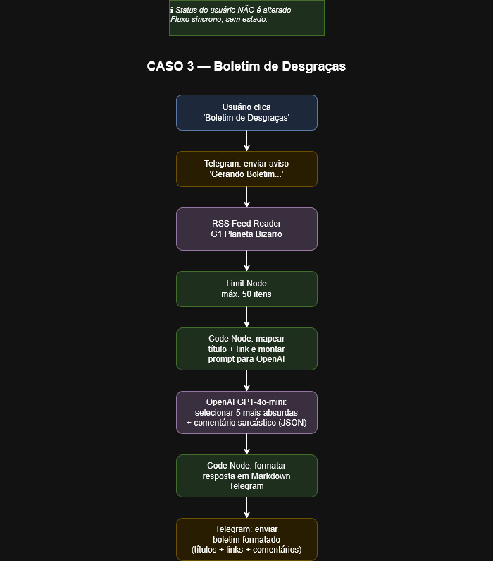
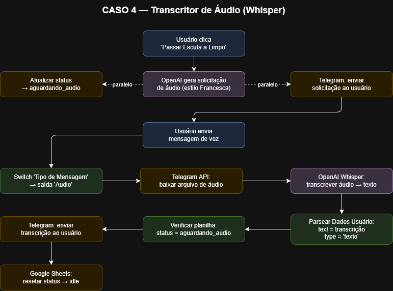

# 🤖 Francesca Liddy Bot

> *"Aqui é a Francesca, do escritório do Saul Goodman. Escolha uma opção e faça isso rápido."*

Bot no Telegram com persona de IA construído com **n8n**, **OpenAI** e **Google Workspace**, desenvolvido como projeto de processo seletivo para vaga de estágio em automação low-code.

O bot assume a personalidade de **Francesca Liddy**, a secretária cínica e impaciente da série *Better Call Saul*, oferecendo uma experiência de usuário única e memorável enquanto executa automações reais de documentos.

---

## 📐 Arquitetura Macro



---

## ⚙️ Stack Tecnológico

| Camada | Tecnologia |
|---|---|
| Orquestração | n8n (self-hosted) |
| IA Generativa | OpenAI GPT-4o-mini + Whisper |
| Interface | Telegram Bot API |
| Documentos | Google Docs API + Google Drive API |
| Persistência de sessão | Google Sheets |
| Servidor | VPS DigitalOcean (Ubuntu 22.04) |
| Conteinerização | Docker + Docker Compose |
| Túnel HTTPS | Ngrok (Systemd Service) |

---

## 🎯 Casos de Uso

### Caso 1 — Notificação Extrajudicial
Usuário envia um texto livre → bot injeta no template com papel timbrado do escritório Saul Goodman & Associados → devolve **PDF + link público** no chat.

**Marcador usado:** `<<texto>>`



---

### Caso 2 — Relato de Desastre Aéreo
Usuário envia **foto + legenda** com os dados do incidente → OpenAI extrai campos estruturados (nome, endereço, telefone, bens danificados etc.) → bot preenche múltiplos marcadores de texto e **injeta a imagem** no documento → devolve PDF + link público.

**Marcadores usados:** `<<nome>>`, `<<endereco>>`, `<<telefone>>`, `<<local_impacto>>`, `<<resumo_incidente>>`, `<<bens_danificados>>`, `<<foto>>`

> ⚠️ **Desafio técnico:** o n8n não possui nó nativo para inserir imagens em Google Docs. Solução implementada via API bruta (`batchUpdate`) com `deleteContentRange` + `insertInlineImage`, localizando o índice exato do marcador no JSON do documento.



---

### Caso 3 — Boletim de Desgraças
Bot lê o feed RSS do **G1 Planeta Bizarro** em tempo real → OpenAI seleciona as 5 notícias mais absurdas e gera um comentário sarcástico da Francesca para cada uma → envia boletim formatado em Markdown com títulos, comentários e links.



---

### Caso 4 — Transcritor de Áudio
Usuário envia mensagem de voz → **OpenAI Whisper** transcreve o áudio → bot devolve o texto transcrito no chat.



---

## 🧠 Inteligência Conversacional

Além dos 4 casos, o bot responde a mensagens livres com classificação de intenção via IA:

- **Saudação** → Francesca se apresenta com impaciência e mostra o menu
- **Dúvida** → Francesca explica os recursos com sarcasmo
- **Bobeira** → Francesca corta a conversa e manda o usuário escolher uma opção

Nenhuma mensagem cai no vazio — inclusive tipos não suportados (sticker, documento, gif) recebem uma resposta na persona.

---

## 🗄️ Persistência de Sessão

O estado de cada usuário é rastreado via **Google Sheets**, permitindo fluxos multi-etapa:

| Status | Significado |
|---|---|
| `idle` | Aguardando ação |
| `aguardando_caso1` | Aguardando texto da notificação |
| `aguardando_caso2` | Aguardando foto + legenda do relato |
| `aguardando_audio` | Aguardando mensagem de voz |

Um segundo workflow (`Francesca_Liddy_Resetar_Status.json`) roda a cada hora via Schedule Trigger e reseta automaticamente sessões travadas há mais de 1 hora.

---

## 📁 Estrutura do Repositório

```
francesca-liddy-bot/
├── workflows/
│   ├── Francesca_Liddy.json               # Workflow principal
│   └── Francesca_Liddy_Resetar_Status.json # Reset automático de sessões
├── assets/
│   ├── Arquitetura_Macro.jpg
│   ├── Fluxo_Caso_1.jpg
│   ├── Fluxo_Caso_2.jpg
│   ├── Fluxo_Caso_3.jpg
│   └── Fluxo_Caso_4.jpg
├── diagramas/
│   ├── Arquitetura_Macro.drawio
│   ├── Fluxo_Caso_1.drawio
│   ├── Fluxo_Caso_2.drawio
│   ├── Fluxo_Caso_3.drawio
│   └── Fluxo_Caso_4.drawio
└── README.md
```

---

## 🚀 Como importar os workflows

1. Acesse sua instância do n8n
2. Vá em **Workflows → Import from file**
3. Importe `Francesca_Liddy.json` e `Francesca_Liddy_Resetar_Status.json`
4. Configure as credenciais conforme a seção abaixo
5. Ative os dois workflows

> **Nota:** O bot foi desenvolvido e testado em instância n8n self-hosted via Docker em VPS DigitalOcean. Atualmente pausado por questões de custo de infraestrutura.

---

## 🔑 Configuração de Credenciais

Os arquivos JSON dos workflows foram sanitizados para publicação — todas as credenciais e IDs sensíveis foram substituídos por placeholders. Antes de usar, você precisará substituí-los pelos seus próprios valores.

### Placeholders nos JSONs e o que configurar

| Placeholder | O que é | Onde obter |
|---|---|---|
| `YOUR_TELEGRAM_CREDENTIAL_ID` | Token do bot no Telegram | [@BotFather](https://t.me/BotFather) no Telegram |
| `YOUR_GOOGLE_SHEETS_CREDENTIAL_ID` | OAuth2 do Google Sheets | [Google Cloud Console](https://console.cloud.google.com) |
| `YOUR_GOOGLE_DRIVE_CREDENTIAL_ID` | OAuth2 do Google Drive | [Google Cloud Console](https://console.cloud.google.com) |
| `YOUR_GOOGLE_DOCS_CREDENTIAL_ID` | OAuth2 do Google Docs | [Google Cloud Console](https://console.cloud.google.com) |
| `YOUR_OPENAI_CREDENTIAL_ID` | Chave de API da OpenAI | [platform.openai.com](https://platform.openai.com) |
| `YOUR_SPREADSHEET_ID` | ID da planilha Google Sheets de controle de sessão | ID na URL da planilha: `docs.google.com/spreadsheets/d/`**`SEU_ID`**`/edit` |
| `YOUR_INSTANCE_ID` | ID da instância n8n | Gerado automaticamente pelo n8n — pode ignorar |

### APIs do Google que precisam estar ativadas

No [Google Cloud Console](https://console.cloud.google.com), ative as seguintes APIs no seu projeto:
- Google Drive API
- Google Docs API
- Google Sheets API

### Estrutura da planilha de controle de sessão

Crie uma planilha Google Sheets com uma aba chamada `estados` contendo as colunas:

| chat_id | status | updated_at |
|---|---|---|
| (preenchido automaticamente) | (preenchido automaticamente) | (preenchido automaticamente) |

---

## 👤 Autor

**Emanuel Lucas Nogueira da Silva**  
[LinkedIn](https://linkedin.com/in/seu-perfil) · [GitHub](https://github.com/seu-usuario)
